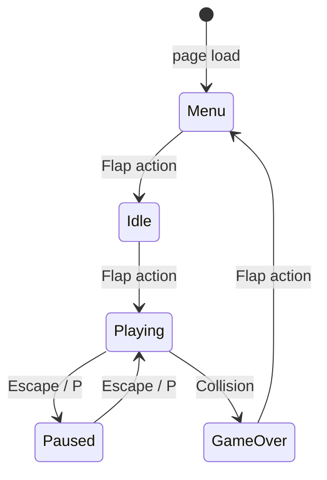

# Design Document: Flappy Kiro

## Overview

Flappy Kiro is a browser-based endless scroller game delivered as a single HTML file with sibling asset files. The player controls "Ghosty", a ghost sprite that falls under gravity and flaps upward on input, navigating through scrolling pipe and cloud obstacles. The game uses HTML5 Canvas for rendering, the Web Audio API for sound, and `localStorage` for high score persistence. There is no build step, no framework, and no server dependency.

The architecture is a classic game loop: `requestAnimationFrame` drives a fixed-timestep-scaled update/render cycle. All logic is split into six cooperating components (Renderer, Physics_Engine, Input_Handler, Collision_Detector, Score_Manager, Audio_Manager) coordinated by a central `Game` object that owns the state machine.

---

## Architecture

### Game Loop

```
requestAnimationFrame
  └─> Game.loop(timestamp)
        ├─> deltaTime = (timestamp - lastTimestamp) / 16.67
        ├─> Input_Handler.flush()          // consume queued events
        ├─> Game.update(deltaTime)         // state-gated logic
        │     ├─> Physics_Engine.update()
        │     ├─> Collision_Detector.check()
        │     ├─> Score_Manager.check()
        │     └─> Effects.update()        // particles, popups, shake
        └─> Renderer.draw()
```

### State Machine



States: `MENU`, `IDLE`, `PLAYING`, `PAUSED`, `GAME_OVER`

### File Layout

```
index.html          ← single entry point; inline CSS + <script src="config.js"> + <script src="game.js">
config.js           ← all tunable constants in a single CONFIG object
game.js             ← all game logic (~600–800 lines)
assets/
  ghosty.png
  jump.wav
  game_over.wav
```

No build tooling. All code is plain ES2020 vanilla JavaScript.

### Configuration

All tunable constants live in `config.js` as a single frozen object. No magic numbers anywhere in `game.js` — every component reads from `CONFIG`.

```js
// config.js
const CONFIG = Object.freeze({
  physics: {
    gravity:           0.5,   // px/frame²
    flapVelocity:     -8,     // px/frame (upward)
    terminalVelocity:  12,    // px/frame (downward)
    maxDeltaTime:      3,     // frame multiplier cap
  },
  pipes: {
    speed:             3,     // px/frame
    width:             60,    // px
    gapHeight:         150,   // px
    spawnInterval:     1800,  // ms
  },
  clouds: {
    speed:             2,     // px/frame
    minInterval:       2000,  // ms
    maxInterval:       5000,  // ms
  },
  effects: {
    shakeIntensity:    5,     // px
    shakeDuration:     300,   // ms
    particleMaxAge:    500,   // ms
    popupMaxAge:       600,   // ms
    popupRiseDistance: 30,    // px
  },
  audio: {
    musicVolume:       0.4,
    sfxVolume:         1.0,
  },
});
```

To tweak the game feel, open `config.js` and change values — no hunting through game logic required.

---

## Components and Interfaces

### Game (coordinator)

Owns the state machine, the game loop, and references to all components. Responsible for state transitions and wiring component calls in the correct order.

```js
class Game {
  state: GameState          // current state enum value
  lastTimestamp: number
  loop(timestamp)           // rAF callback
  update(dt)                // dispatches to components based on state
  transitionTo(state)       // handles side-effects of state changes
  reset()                   // resets score, obstacles, Ghosty position
}
```

### Renderer

Draws everything to the Canvas each frame. Stateless with respect to game logic — it reads from shared game state and draws.

```js
class Renderer {
  canvas: HTMLCanvasElement
  ctx: CanvasRenderingContext2D
  draw(gameState, ghosty, obstacles, effects, score)
  drawBackground()
  drawGhosty(ghosty)
  drawPipes(pipes)
  drawClouds(clouds)
  drawParticles(particles)
  drawScorePopups(popups)
  drawHUD(score, highScore)
  drawOverlay(state)        // Menu / Paused / GameOver overlays
  applyShake(shake)         // translates ctx by shake offset
}
```

Sketchy style is achieved by using `ctx.shadowBlur`, slightly randomised stroke offsets, and `ctx.lineJoin = 'round'`.

### Physics_Engine

Updates Ghosty's velocity and position each frame using delta-time scaling.

```js
class PhysicsEngine {
  // All constants read from CONFIG.physics — no hardcoded values
  update(ghosty, dt)
  flap(ghosty)
}
```

Delta-time formula: `effectiveAccel = CONFIG.physics.gravity * dt`, `velocity = clamp(velocity + effectiveAccel, -Infinity, CONFIG.physics.terminalVelocity)`.

### Input_Handler

Listens to `keydown`, `click`, and `touchstart` events. Queues actions so the game loop consumes them once per frame.

```js
class InputHandler {
  pendingFlap: boolean
  pendingPause: boolean
  attach(canvas)            // registers event listeners
  flush(): { flap, pause }  // returns and clears pending flags
}
```

Pause keys: `Escape`, `p`, `P`. Flap keys: `Space`, `' '`.

### Collision_Detector

Pure function — takes Ghosty's bounding box and the obstacle list, returns a boolean.

```js
class CollisionDetector {
  check(ghosty, pipes, clouds, canvasHeight): boolean
  // returns true if any overlap or boundary breach detected
}
```

Hitbox: axis-aligned bounding box (AABB) slightly inset from the sprite dimensions (80% of sprite size) to feel fair.

### Score_Manager

Tracks current score and high score. Handles localStorage persistence.

```js
class ScoreManager {
  score: number
  highScore: number
  load()                    // reads localStorage on init
  checkPipes(pipes, ghosty) // increments score when pipe is passed
  onGameOver()              // persists high score if beaten
  reset()                   // resets score to 0
}
```

A pipe is "passed" when `pipe.x + pipe.width < ghosty.x` and the pipe has not yet been counted (tracked via a `scored` flag on each pipe).

### Audio_Manager

Wraps `HTMLAudioElement` for sound effects and `AudioContext` for procedural background music.

```js
class AudioManager {
  ctx: AudioContext
  bgGain: GainNode
  playFlap()
  playScore()
  playGameOver()
  startMusic()
  pauseMusic()
  resumeMusic()
  stopMusic()
}
```

Background music: a simple two-oscillator melody (square wave + triangle wave) driven by a `ScriptProcessorNode` or a scheduled sequence of `OscillatorNode`s. No external file required.

Sound effects (`jump.wav`, `game_over.wav`) are loaded via `new Audio(path)` and replayed by resetting `currentTime = 0` before each `play()` call to allow rapid re-triggering.

### Effects (Particle_Trail, Screen_Shake, Score_Popup)

Managed as arrays of transient objects updated each frame.

```js
// Particle — maxAge from CONFIG.effects.particleMaxAge
{ x, y, vx, vy, opacity, age, maxAge: CONFIG.effects.particleMaxAge }

// ScorePopup — maxAge and rise distance from CONFIG.effects
{ x, y, opacity, age, maxAge: CONFIG.effects.popupMaxAge, offsetY: 0 }

// ScreenShake — duration and intensity from CONFIG.effects
{ duration: CONFIG.effects.shakeDuration, elapsed: 0, intensity: CONFIG.effects.shakeIntensity }
```

Each frame: age is incremented by `dt * 16.67` (ms), opacity interpolated from 1→0, expired entries spliced out.

---

## Data Models

### GameState (enum)

```js
const GameState = Object.freeze({
  MENU:      'MENU',
  IDLE:      'IDLE',
  PLAYING:   'PLAYING',
  PAUSED:    'PAUSED',
  GAME_OVER: 'GAME_OVER',
});
```

### Ghosty

```js
{
  x: number,          // fixed horizontal position (25% canvas width)
  y: number,          // vertical position (top of sprite)
  vy: number,         // vertical velocity (px/frame)
  width: number,      // sprite render width
  height: number,     // sprite render height
  img: HTMLImageElement
}
```

### Pipe

```js
{
  x: number,          // left edge of pipe pair
  width: number,      // pipe width (fixed ~60px)
  gapY: number,       // top of gap
  gapHeight: number,  // gap height (fixed ~150px)
  speed: number,      // scroll speed (px/frame)
  scored: boolean     // whether this pipe has been counted
}
```

### Cloud

```js
{
  x: number,
  y: number,
  width: number,
  height: number,
  speed: number
}
```

### Particle

```js
{
  x: number, y: number,
  vx: number, vy: number,
  opacity: number,
  age: number,        // ms elapsed
  maxAge: 500         // ms
}
```

### ScorePopup

```js
{
  x: number,
  y: number,          // initial y (gap center)
  offsetY: number,    // increases each frame (floats upward 30px total)
  opacity: number,
  age: number,
  maxAge: 600
}
```

### ScreenShake

```js
{
  elapsed: number,    // ms elapsed
  duration: 300,      // ms total
  intensity: 5        // max px offset
}
```

### ScoreState

```js
{
  score: number,
  highScore: number
}
```

---

## Correctness Properties

*A property is a characteristic or behavior that should hold true across all valid executions of a system — essentially, a formal statement about what the system should do. Properties serve as the bridge between human-readable specifications and machine-verifiable correctness guarantees.*

### Property 1: Flap sets velocity to FLAP_VELOCITY

*For any* Ghosty state (any current vy), calling `PhysicsEngine.flap(ghosty)` should set `ghosty.vy` to exactly `-8` (FLAP_VELOCITY), regardless of prior velocity.

**Validates: Requirements 2.4, 3.2**

---

### Property 2: Physics halted while Paused

*For any* Ghosty position and velocity, calling `PhysicsEngine.update(ghosty, dt)` while the game state is `PAUSED` should leave `ghosty.y` and `ghosty.vy` unchanged.

**Validates: Requirements 2a.2**

---

### Property 3: Flap ignored while Paused

*For any* Ghosty state, processing a flap action while the game state is `PAUSED` should not change `ghosty.vy`.

**Validates: Requirements 2a.5**

---

### Property 4: Gravity accumulates velocity each frame

*For any* Ghosty with `vy < TERMINAL_VELOCITY` and any positive `dt`, after `PhysicsEngine.update(ghosty, dt)`, the new `vy` should equal `old_vy + (GRAVITY * dt)` (clamped to TERMINAL_VELOCITY).

**Validates: Requirements 3.1**

---

### Property 5: Position updated by velocity each frame

*For any* Ghosty position and velocity, after `PhysicsEngine.update(ghosty, dt)`, `ghosty.y` should equal `old_y + (vy * dt)`.

**Validates: Requirements 3.3, 3.5**

---

### Property 6: Terminal velocity is enforced

*For any* Ghosty with `vy` greater than `TERMINAL_VELOCITY` (12), after `PhysicsEngine.update(ghosty, dt)`, `ghosty.vy` should be at most `TERMINAL_VELOCITY`.

**Validates: Requirements 3.4**

---

### Property 7: Delta-time proportionality

*For any* Ghosty state and any `dt`, running two consecutive updates with `dt/2` each should produce the same final position as one update with `dt` (within floating-point tolerance), confirming linear delta-time scaling.

**Validates: Requirements 3.6**

---

### Property 8: Obstacles scroll left each frame

*For any* pipe or cloud in the active obstacle list, after one game update step, its `x` coordinate should be strictly less than its previous `x` coordinate.

**Validates: Requirements 4.2, 5.2**

---

### Property 9: Off-screen obstacles are removed

*For any* obstacle list after an update step, no pipe or cloud should have `x + width <= 0` (i.e., fully off the left edge). All such obstacles must have been removed.

**Validates: Requirements 4.4, 5.4**

---

### Property 10: Gap bounds invariant

*For any* newly spawned pipe, `gapY >= 0`, `gapY + gapHeight <= canvasHeight`, and `gapHeight` equals the configured constant gap size, ensuring the gap is always fully within the canvas and passable.

**Validates: Requirements 4.5, 4.6**

---

### Property 11: Pipe collision detection

*For any* Ghosty AABB that overlaps the top pipe rectangle or bottom pipe rectangle of any active pipe pair, `CollisionDetector.check()` should return `true`.

**Validates: Requirements 6.1**

---

### Property 12: Boundary collision detection

*For any* Ghosty position where `ghosty.y <= 0` or `ghosty.y + ghosty.height >= canvasHeight`, `CollisionDetector.check()` should return `true`.

**Validates: Requirements 6.2**

---

### Property 13: Cloud collision detection

*For any* Ghosty AABB that overlaps a cloud's AABB, `CollisionDetector.check()` should return `true`.

**Validates: Requirements 5.5**

---

### Property 14: High score persistence round-trip

*For any* score value greater than the current high score, after `ScoreManager.onGameOver()`, reading the high score key from `localStorage` and constructing a new `ScoreManager` that calls `load()` should yield a `highScore` equal to that score value.

**Validates: Requirements 6.6, 6.7, 7.2, 7.5**

---

### Property 15: Score increments on pipe pass

*For any* pipe where `pipe.x + pipe.width < ghosty.x` and `pipe.scored === false`, after `ScoreManager.checkPipes()`, `score` should have increased by exactly 1 and `pipe.scored` should be `true`.

**Validates: Requirements 7.1**

---

### Property 16: Score resets to zero on game reset

*For any* score value, after `ScoreManager.reset()`, `score` should equal `0`.

**Validates: Requirements 7.4**

---

### Property 17: Screen shake created on collision

*For any* collision event, the resulting `ScreenShake` object should have `duration === 300` and `intensity === 5`, and `elapsed === 0`.

**Validates: Requirements 11.1**

---

### Property 18: Particle emitted each Playing frame

*For any* game update while in the `PLAYING` state, the particle array length should be greater than or equal to its length before the update (at least one particle is added per frame).

**Validates: Requirements 11.2**

---

### Property 19: Score popup created on score increment

*For any* score increment event, a `ScorePopup` should be added to the popups array with `x` equal to the pipe's horizontal position and `y` equal to the vertical center of the pipe's gap.

**Validates: Requirements 11.3**

---

### Property 20: Expired effects are removed each frame

*For any* particle or score popup with `age >= maxAge`, after one effects update step, that element should no longer be present in its respective array.

**Validates: Requirements 11.4**

---

## Error Handling

### Asset Loading Failures

- `ghosty.png` is loaded via `new Image()`. If it fails to load (`onerror`), the Renderer falls back to drawing a simple white circle in place of the sprite so the game remains playable.
- `jump.wav` and `game_over.wav` are loaded via `new Audio()`. If they fail, `AudioManager` catches the rejected `play()` promise and silently skips playback — the game continues without sound.

### AudioContext Autoplay Policy

- `AudioContext` is created lazily on the first user gesture (flap action). Before that, `AudioManager` no-ops all calls. This satisfies browser autoplay restrictions (Requirement 9.8).
- If `AudioContext` creation throws (e.g., unsupported browser), the error is caught and audio is disabled for the session.

### localStorage Unavailability

- `ScoreManager.load()` and persistence calls are wrapped in `try/catch`. If `localStorage` is unavailable (private browsing mode, storage quota exceeded), the high score defaults to `0` and is held in memory only for the session.

### Frame Rate Anomalies

- Delta-time is clamped to a maximum of `3` (equivalent to ~50ms, or ~3 missed frames at 60fps) to prevent large positional jumps after tab switches or browser throttling.

### Canvas Resize

- A `resize` event listener on `window` updates `canvas.width` and `canvas.height` to match `window.innerWidth` / `window.innerHeight`. Ghosty's fixed x-position (25% of canvas width) is recalculated on resize. Pipe and cloud positions are preserved as-is.

---

## Testing Strategy

### Dual Testing Approach

Both unit tests and property-based tests are required. They are complementary:

- **Unit tests** cover specific examples, state transitions, and integration points.
- **Property-based tests** verify universal invariants across randomized inputs.

### Property-Based Testing

**Library**: [fast-check](https://github.com/dubzzz/fast-check) (JavaScript/TypeScript, runs in Node.js with no build step required for tests).

Each correctness property from the design document maps to exactly one property-based test. Tests run a minimum of **100 iterations** each.

Tag format in test comments:
```
// Feature: flappy-kiro, Property N: <property_text>
```

Example:
```js
// Feature: flappy-kiro, Property 6: Terminal velocity is enforced
fc.assert(fc.property(
  fc.float({ min: 13, max: 1000 }),  // vy above terminal
  fc.float({ min: 0.5, max: 3 }),    // dt
  (vy, dt) => {
    const ghosty = makeGhosty({ vy });
    physicsEngine.update(ghosty, dt);
    return ghosty.vy <= TERMINAL_VELOCITY;
  }
), { numRuns: 100 });
```

Properties to implement as PBT tests: P1–P20 (all 20 properties listed above).

### Unit Tests

Unit tests focus on:

- **State transitions**: Menu→Idle, Idle→Playing, Playing→Paused, Paused→Playing, Playing→GameOver, GameOver→Menu
- **Input handling**: spacebar, click, and touch events each produce a flap; Escape/P produce a pause toggle
- **Score edge cases**: score does not double-increment for the same pipe; high score not overwritten when current score is lower
- **Asset fallback**: game renders without crash when `ghosty.png` fails to load
- **localStorage fallback**: ScoreManager behaves correctly when localStorage throws

**Framework**: Plain `assert` with Node.js built-in `node:test` runner (no external test framework needed, consistent with the no-build-step philosophy).

### Test File Layout

```
tests/
  physics.test.js       ← P1–P7 (PhysicsEngine properties + unit tests)
  obstacles.test.js     ← P8–P10 (pipe/cloud scrolling and bounds)
  collision.test.js     ← P11–P13 (CollisionDetector properties)
  score.test.js         ← P14–P16 (ScoreManager properties + unit tests)
  effects.test.js       ← P17–P20 (effects properties)
  state.test.js         ← state transition unit tests
  input.test.js         ← InputHandler unit tests
```

Run with:
```
node --test tests/**/*.test.js
```
