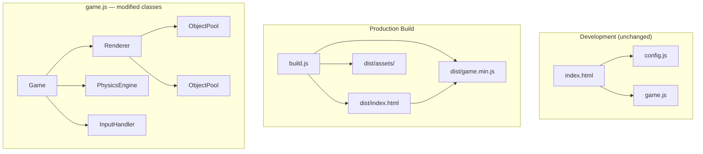

# Design Document: Production Readiness

## Overview

This document describes the technical design for making Flappy Kiro production-ready. The game is a vanilla JS browser game with no build tooling, a single monolithic `game.js` (~1100 lines), and raw assets served without optimization. Four areas are addressed:

1. **HiDPI/Retina rendering** — sharp graphics on high-density displays via `devicePixelRatio`-aware canvas sizing
2. **Optimized rendering** — context initialization options, background caching, shadow state management, and coordinate rounding
3. **Object pooling** — eliminate GC pressure from per-frame particle and popup allocations
4. **Mobile responsiveness** — viewport meta, safe-area insets, touch-action CSS
5. **Asset bundling** — a Node.js build script that minifies and packages the game for deployment

The game must continue to run correctly in Chrome, Firefox, and Safari without plugins, and must remain openable via `file://` or a local HTTP server with no build step required for development.

---

## Architecture

The existing architecture is a single IIFE in `game.js` containing all game classes. No structural changes to the class hierarchy are needed. All changes are targeted modifications within existing classes and a new `build.js` script.



### Key Architectural Decisions

- **No bundler daemon**: `build.js` is a plain Node.js script using `child_process.execSync` to invoke `terser`. No webpack, rollup, or esbuild daemon is introduced, keeping the dev workflow unchanged.
- **In-place class modification**: `ObjectPool` is a new helper class added inside the IIFE. `Renderer` and `Game` are modified in-place. No new files are added to the dev tree.
- **Seeded background texture**: The background cache uses a deterministic pseudo-random sequence (seeded LCG) so the texture is stable across cache rebuilds and does not flicker.

---

## Components and Interfaces

### 1. HiDPI Canvas Sizing — `Game._resize()`

The existing `_resize()` method sets `canvas.width/height` to `window.innerWidth/Height`. It must be updated to multiply by `window.devicePixelRatio` and scale the context.

```js
_resize() {
  const dpr = window.devicePixelRatio || 1;
  const logicalW = window.innerWidth;
  const logicalH = window.innerHeight;
  this._canvas.width  = Math.round(logicalW * dpr);
  this._canvas.height = Math.round(logicalH * dpr);
  this._canvas.style.width  = logicalW + 'px';
  this._canvas.style.height = logicalH + 'px';
  if (this._renderer) this._renderer.resize();
}
```

After `_resize()`, `Renderer.resize()` calls `ctx.scale(dpr, dpr)` so all subsequent draw calls use CSS-pixel coordinates. The renderer caches `_dpr` and reapplies the scale at the start of each `draw()` call via `ctx.setTransform(dpr, 0, 0, dpr, 0, 0)` (replaces the current transform rather than accumulating).

### 2. Context Initialization — `Renderer` constructor

The context is obtained once with performance hints:

```js
this.ctx = canvas.getContext('2d', { alpha: false, willReadFrequently: false });
```

`alpha: false` skips Porter-Duff blending on every composite. `willReadFrequently: false` prevents Chrome from disabling GPU acceleration. The context reference is stored on `this.ctx` and never re-obtained.

### 3. Background Cache — `Renderer._drawBackground()`

The existing implementation already uses an offscreen canvas cache (`this._bgCanvas`). Two changes are needed:

- **Deterministic texture**: Replace `Math.random()` with a seeded LCG so the texture is identical on every rebuild.
- **Physical size match**: The offscreen canvas must be sized to `canvas.width × canvas.height` (physical pixels), not logical pixels.

```js
// Seeded LCG — deterministic per canvas size
function seededRandom(seed) {
  let s = seed;
  return () => {
    s = (s * 1664525 + 1013904223) & 0xffffffff;
    return (s >>> 0) / 0xffffffff;
  };
}
```

The cache is invalidated when `canvas.width` or `canvas.height` changes (physical dimensions), not logical dimensions.

### 4. Shadow Blur Reset — `Renderer._drawPipes()`

After the pipe draw pass, shadow state must be explicitly cleared:

```js
// After all pipe rects are drawn:
ctx.shadowBlur  = 0;
ctx.shadowColor = 'transparent';
ctx.restore();
```

This is already partially handled by `ctx.save()/restore()` in the current implementation, but the shadow properties must be explicitly reset before `ctx.restore()` to guarantee they don't bleed into subsequent draws in browsers that don't fully isolate shadow state within save/restore.

### 5. Object Pool — new `ObjectPool` class

A generic fixed-capacity pool added inside the IIFE:

```js
class ObjectPool {
  constructor(factory, capacity) {
    this._pool    = Array.from({ length: capacity }, factory);
    this._active  = new Set();
  }

  acquire() {
    for (const obj of this._pool) {
      if (!this._active.has(obj)) {
        this._active.add(obj);
        return obj;
      }
    }
    return null; // pool exhausted — caller skips emission
  }

  release(obj) {
    this._active.delete(obj);
  }

  get activeCount() { return this._active.size; }
}
```

`Game` initializes two pools:

```js
this._particlePool = new ObjectPool(() => ({}), 60);
this._popupPool    = new ObjectPool(() => ({}), 10);
```

`emitParticle` and `createScorePopup` are updated to call `pool.acquire()` and reset fields on the returned object. Expiry logic calls `pool.release(obj)` instead of `splice`.

### 6. Mobile Viewport — `index.html`

Three changes to `index.html`:

```html
<!-- Viewport meta -->
<meta name="viewport" content="width=device-width, initial-scale=1.0, viewport-fit=cover" />

<!-- CSS additions -->
canvas {
  display: block;
  touch-action: none;
}
body {
  padding-bottom: env(safe-area-inset-bottom);
}
```

The `touch-action: none` prevents scroll/zoom on tap. The `env(safe-area-inset-bottom)` padding ensures the HUD bar clears the iOS home indicator.

### 7. Build Script — `build.js`

A Node.js script with no external runtime dependencies beyond `terser` (dev dependency):

```
build.js
  1. Read config.js + game.js, concatenate
  2. Run terser on concatenated source → dist/game.min.js
  3. Read index.html, replace script tags → dist/index.html
  4. Copy assets/ → dist/assets/
  5. Verify outputs exist and are non-empty
  6. Print file sizes to stdout
```

`package.json` additions:

```json
{
  "scripts": {
    "build": "node build.js"
  },
  "devDependencies": {
    "terser": "^5.0.0"
  }
}
```

### 8. Coordinate Rounding — `Renderer`

All draw calls that accept x/y coordinates are wrapped with `Math.round()` at call time. Source object fields are never mutated:

```js
// Ghosty
ctx.drawImage(img, Math.round(x - w/2), Math.round(y - h/2), w, h);

// Pipes
ctx.fillRect(Math.round(x), Math.round(y), Math.round(w), Math.round(h));

// Clouds
ctx.roundRect(Math.round(c.x), Math.round(c.y), Math.round(c.width), Math.round(c.height), 12);
```

### 9. Frame Stability — `Game._loop()`

Two additions:

```js
// visibilitychange reset
document.addEventListener('visibilitychange', () => {
  if (!document.hidden) this._lastTimestamp = performance.now();
});

// Delta-time clamp (already present, verify it's applied before dtSec)
const dtSec = Math.min(elapsed, CONFIG.physics.maxDeltaTime) / 1000;
```

Canvas dimensions are cached at the start of `_loop()`:

```js
const cw = this._canvas.width;
const ch = this._canvas.height;
```

And passed to all methods that need them, rather than reading `canvas.width/height` inside draw loops.

---

## Data Models

### ObjectPool

```
ObjectPool {
  _pool:   Object[]   // pre-allocated fixed-size array
  _active: Set        // currently in-use objects
  capacity: number    // _pool.length
}
```

### Particle (pooled)

```
Particle {
  x, y:       number   // position (px)
  vx, vy:     number   // velocity (px/s)
  opacity:    number   // 0–1
  age:        number   // ms since emission
  maxAge:     number   // ms (from CONFIG)
}
```

### ScorePopup (pooled)

```
ScorePopup {
  x, y:       number   // anchor position (px)
  offsetY:    number   // rise offset (px)
  opacity:    number   // 0–1
  age:        number   // ms since creation
  maxAge:     number   // ms (from CONFIG)
}
```

### Build Output

```
dist/
  index.html        — updated script references
  game.min.js       — minified bundle (config.js + game.js)
  assets/
    ghosty.png
    jump.wav
    game_over.wav
```

---

## Correctness Properties

*A property is a characteristic or behavior that should hold true across all valid executions of a system — essentially, a formal statement about what the system should do. Properties serve as the bridge between human-readable specifications and machine-verifiable correctness guarantees.*

### Property 1: Canvas physical dimensions equal logical dimensions × DPR

*For any* logical canvas size (width, height) and any device pixel ratio value ≥ 1, after `_resize()` is called, `canvas.width` must equal `Math.round(logicalWidth × dpr)` and `canvas.height` must equal `Math.round(logicalHeight × dpr)`, and `canvas.style.width` must equal `logicalWidth + 'px'`.

**Validates: Requirements 1.1, 1.2, 1.4**

---

### Property 2: Background cache is rebuilt exactly when canvas dimensions change

*For any* sequence of resize events, the background cache (`_bgCanvas`) must be `null` immediately after `Renderer.resize()` is called, and must be non-null after the next `draw()` call. While canvas dimensions remain unchanged across multiple `draw()` calls, the cache object reference must remain the same (no rebuild).

**Validates: Requirements 3.1, 3.2, 3.3**

---

### Property 3: Background cache dimensions match physical canvas size

*For any* canvas physical size (after DPR scaling), the background cache canvas must have `width === canvas.width` and `height === canvas.height`.

**Validates: Requirements 3.4**

---

### Property 4: Background texture is deterministic across rebuilds

*For any* canvas size, rebuilding the background cache twice must produce identical pixel data (same texture, no flicker).

**Validates: Requirements 3.5**

---

### Property 5: Shadow state is reset after pipe draw pass

*For any* list of pipes (including the empty list), after `_drawPipes()` completes, `ctx.shadowBlur` must be `0` and `ctx.shadowColor` must be `'transparent'`.

**Validates: Requirements 4.1, 4.2, 4.3**

---

### Property 6: Object pool acquire/release round-trip

*For any* sequence of particle emissions and expirations within pool capacity, each acquired object must be the same reference as a previously released object (no new heap allocations), and the active count must never exceed the pool capacity.

**Validates: Requirements 5.2, 5.3, 5.5, 5.6**

---

### Property 7: Pool exhaustion is silent — no heap fallback

*For any* pool that is fully exhausted (all objects active), requesting one more acquisition must return `null` and the active count must remain at capacity (no new object allocated).

**Validates: Requirements 5.7**

---

### Property 8: Coordinate rounding does not mutate game objects

*For any* game object (pipe, cloud, ghosty) with arbitrary floating-point `x`, `y`, `width`, `height` values, after a `draw()` call, those fields must be unchanged (rounding applied only at draw time).

**Validates: Requirements 8.3, 9.1, 9.2, 9.3, 9.4**

---

### Property 9: Delta-time clamping

*For any* elapsed time value (including values far exceeding `CONFIG.physics.maxDeltaTime`), the `dtSec` used for physics must equal `Math.min(elapsed, CONFIG.physics.maxDeltaTime) / 1000`.

**Validates: Requirements 8.5**

---

## Error Handling

| Scenario | Handling |
|---|---|
| `terser` not installed when running `build.js` | Script exits with non-zero code and prints an actionable error message |
| `dist/game.min.js` missing or empty after build | Build script exits non-zero with descriptive message |
| Asset file missing from `assets/` during build | Build script exits non-zero listing the missing file |
| `devicePixelRatio` unavailable (old browser) | `_resize()` defaults to `dpr = 1`, identical to current behavior |
| Object pool exhausted | `acquire()` returns `null`; caller silently skips emission — no throw, no heap allocation |
| `ctx.setTransform` unavailable | Fall back to `ctx.scale(dpr, dpr)` after `ctx.clearRect` |

All existing error handling conventions are preserved: `localStorage` wrapped in `try/catch`, `Audio.play()` rejections caught silently, `AudioContext` creation wrapped in `try/catch`.

---

## Testing Strategy

### Dual Testing Approach

Both unit tests and property-based tests are used. Unit tests cover specific examples, initialization behavior, and build script verification. Property tests verify universal invariants across randomized inputs.

### Property-Based Testing

The project already uses **fast-check** (v3.x) with Node's built-in test runner. All new property tests follow the same pattern as existing tests in `tests/`.

Each property test runs a minimum of **100 iterations** (`{ numRuns: 100 }`).

Tag format: `// Feature: production-readiness, Property N: <property text>`

| Property | Test file | fast-check pattern |
|---|---|---|
| P1: Canvas physical dimensions | `tests/renderer.test.js` | `fc.integer` for logical size, `fc.double` for DPR |
| P2: Background cache lifecycle | `tests/renderer.test.js` | `fc.array` of resize/draw events |
| P3: Cache dimensions match physical | `tests/renderer.test.js` | `fc.integer` for canvas size |
| P4: Deterministic texture | `tests/renderer.test.js` | `fc.integer` for canvas size |
| P5: Shadow reset after pipes | `tests/renderer.test.js` | `fc.array` of pipe objects |
| P6: Pool acquire/release round-trip | `tests/effects.test.js` | `fc.integer` for emission count |
| P7: Pool exhaustion silent | `tests/effects.test.js` | Fixed capacity, over-request |
| P8: Coordinate rounding no mutation | `tests/renderer.test.js` | `fc.double` for coordinates |
| P9: Delta-time clamping | `tests/physics.test.js` | `fc.double` for elapsed |

### Unit Tests

Unit tests cover:

- Context initialization options (`alpha: false`, `willReadFrequently: false`) — example
- `getContext` called exactly once — example
- `visibilitychange` resets `_lastTimestamp` — example
- Viewport meta tag present in `index.html` — example (parse HTML string)
- `touch-action: none` present in `index.html` CSS — example
- `env(safe-area-inset-bottom)` present in `index.html` CSS — example
- Build output: `dist/game.min.js` exists and is ≥30% smaller — example (requires build run)
- Build output: all asset files copied — example
- Build output: `dist/index.html` references `game.min.js` — example
- `package.json` has `"build"` script — example

### Test File Organization

New tests are added to existing test files where the subject class matches, or to a new `tests/build.test.js` for build script verification:

```
tests/
  renderer.test.js   — P1–P5, P8 (new properties added to existing file)
  effects.test.js    — P6, P7 (pool tests added to existing file)
  physics.test.js    — P9 (delta-time clamp, added to existing file)
  build.test.js      — NEW: build script verification examples
```
