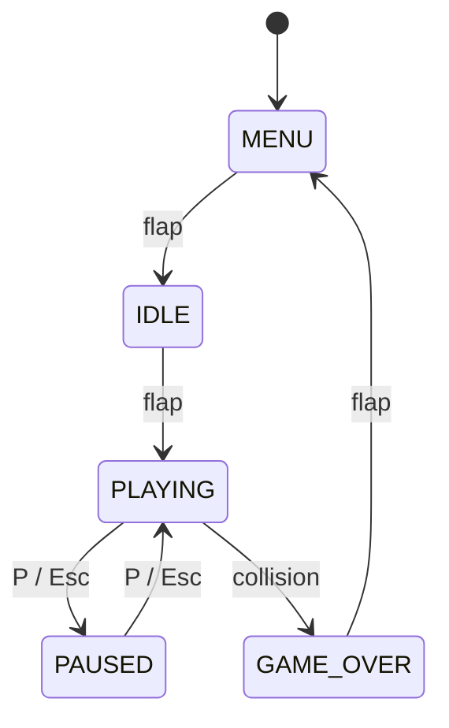
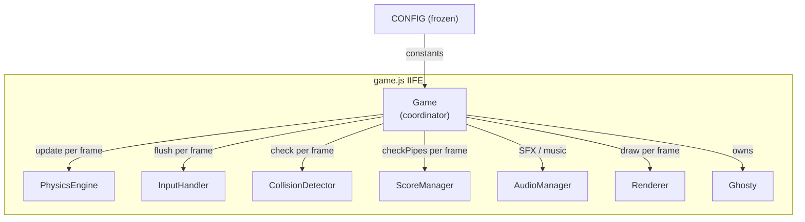
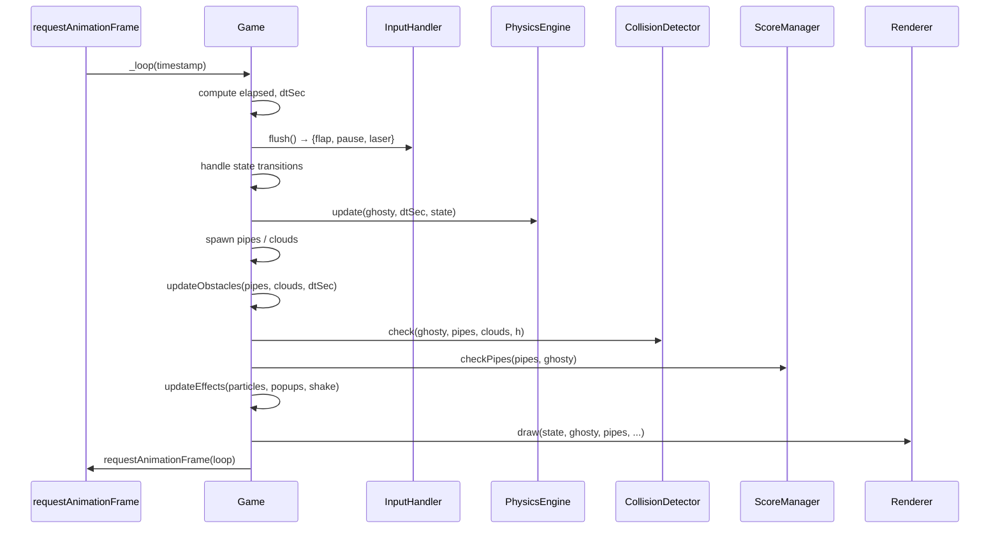
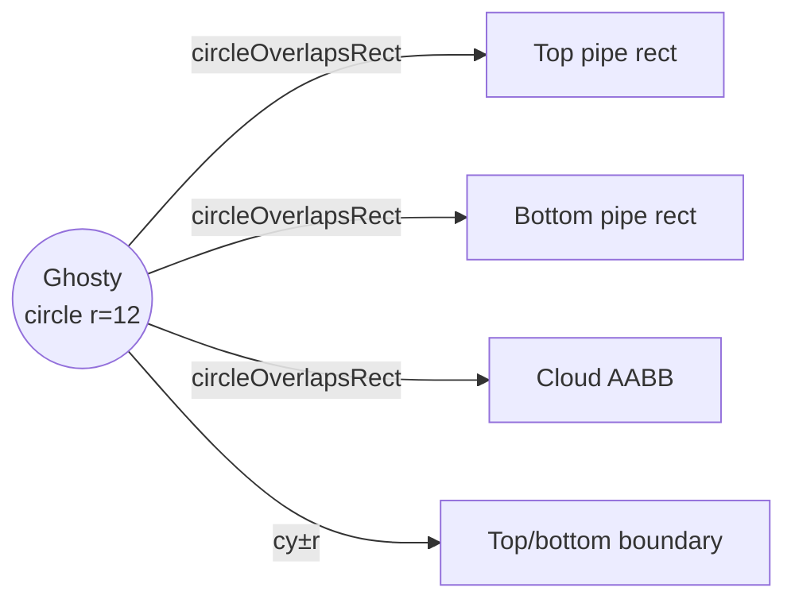
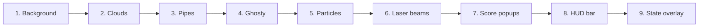

# Flappy Kiro

A browser-based Flappy Bird-style game built with vanilla JavaScript and the Canvas API. No build tools, no dependencies at runtime — just open `index.html` in a browser or serve it with any static file server.


---

## Playing the Game

```bash
python3 -m http.server 8080
# then open http://localhost:8080
```

| Action | Input |
|---|---|
| Flap / advance state | Space, click, or tap |
| Pause / resume | P or Escape |
| Fire laser | L |

### Game States



---

## Project Structure

```
flappy-kiro/
├── index.html        # Full-viewport canvas, loads config.js then game.js
├── config.js         # Frozen CONFIG object — all tunable constants
├── game.js           # Entire game inside one IIFE (no modules)
├── assets/
│   ├── ghosty.png    # 32×32 sprite
│   ├── jump.wav      # Flap SFX
│   └── game_over.wav # Game over SFX
└── tests/            # Node.js property-based tests (fast-check)
    ├── helpers.js
    ├── physics.test.js
    ├── collision.test.js
    ├── score.test.js
    ├── effects.test.js
    ├── obstacles.test.js
    ├── state.test.js
    ├── input.test.js
    └── renderer.test.js
```

---

## Architecture

All game logic lives inside a single IIFE in `game.js`. Each class owns one responsibility and communicates through method arguments — no class reads global state except `CONFIG`.



### Game Loop



---

## Component Reference

### `CONFIG` (`config.js`)
Frozen nested object loaded before `game.js`. All physics, pipe, cloud, effect, and audio constants live here. Never mutate — use multipliers for difficulty scaling.

### `Ghosty`
Character data and animation state. Owns the sprite image, hitbox radius, flap/death timers, and methods for computing visual rotation, bob offset, and death opacity. Reset via `reset(canvasWidth, canvasHeight)`.

### `PhysicsEngine`
Pure update functions. `update(ghosty, dtSec, state)` applies gravity and clamps to terminal velocity. `flap(ghosty, state)` sets upward velocity. Both are no-ops when state is `PAUSED`.

### `InputHandler`
Registers `keydown`, `click`, and `touchstart` listeners once at init. `flush()` returns `{ flap, pause, laser }` and clears all flags — called exactly once per frame.

### `CollisionDetector`
Pure function `check(ghosty, pipes, clouds, canvasHeight)`. Uses a circular hitbox (radius 12px) against pipe rects and cloud AABBs via `circleOverlapsRect`.



### `ScoreManager`
Tracks `score` and `highScore`. `checkPipes(pipes, ghosty)` returns the scored pipe (or `null`) — marks `pipe.scored = true` to prevent double-counting. Persists high score to `localStorage` with `try/catch`.

### `AudioManager`
Lazy `AudioContext` created on first user gesture. Background music is a scheduled two-oscillator (square + triangle) pentatonic loop. SFX use `HTMLAudioElement` with `currentTime = 0` reset for instant replay.

### `Renderer`
Stateless draw pipeline. Accepts all data as arguments, never reads game state directly. Background is pre-rendered to an offscreen canvas and `drawImage`'d each frame. Pipe shadow state is set once per frame outside the pipe loop.

#### Draw order (z-order)


### `Game`
Coordinator. Owns all arrays (`_pipes`, `_clouds`, `_particles`, `_popups`, `_laserBeams`) and timers. All state transitions go through `transitionTo(newState)` — the only place side-effects (audio, reset, shake) are triggered.

---

## Laser

Press `L` during play to fire a horizontal laser beam from Ghosty's right side. The beam carves a hole through any pipe it intersects at Ghosty's current height. 20-second recharge shown bottom-left in the HUD.

```
⚡ LASER [L]   ← ready (cyan)
⚡ 14s         ← recharging (grey)
```

---

## Physics

All values are in px/s or px/s² and scaled by `dtSec` (seconds since last frame):

```
vy += gravity * dtSec          // 800 px/s²
vy  = min(vy, terminalVelocity) // 600 px/s
y  += vy * dtSec
```

Delta-time is capped to `maxDeltaTime` (50ms) to prevent physics tunneling when the tab is backgrounded.

---

## Tests

```bash
npm install          # installs fast-check
npm test             # runs all 84 property-based + unit tests
```

Tests cover 20 correctness properties (P1–P20) across physics, obstacles, collision, scoring, effects, state transitions, input handling, and renderer fallback rendering. All tests run in Node.js with no browser required.

---

## Configuration

Edit `config.js` to tune game feel. Key values:

| Key | Default | Effect |
|---|---|---|
| `physics.gravity` | 800 px/s² | Higher = faster fall |
| `physics.jumpVelocity` | -300 px/s | More negative = higher jump |
| `pipes.speed` | 120 px/s | Higher = faster pipes |
| `pipes.gapHeight` | 140 px | Smaller = harder |
| `pipes.spawnInterval` | 1800 ms | Lower = more frequent pipes |
| `effects.particleMaxAge` | 500 ms | Longer = longer particle trail |
